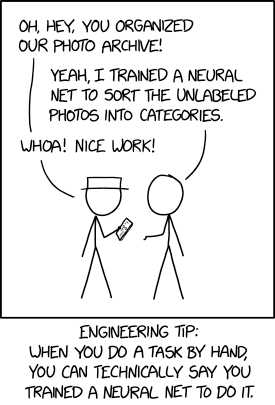

   
  
   
   

<h2 align='center'>Awesome Applied Data Science</h2>

  A curated list of awesome things related to Applied Data Science
   
   
  

## Articles

- [A Bayesian Way of Choosing a Restaurant](https://towardsdatascience.com/a-bayesian-way-of-choosing-a-restaurant-87905a745854)
- [ChatGPT and Bing AI might already be obsolete, according to a new study](https://www.windowscentral.com/software-apps/chatgpt-and-bing-ai-might-already-be-obsolete-according-to-new-study)
- [Density Kernel Depth for Outlier Detection in Functional Data](https://www.kdnuggets.com/density-kernel-depth-for-outlier-detection-in-functional-data)
- [Kop of munt: puur toeval?](https://www.uva.nl/content/nieuws/nieuwsberichten/2023/10/kop-of-munt-puur-toeval.html)
- [Lasso Regression Fundamentals and Modeling in Python](https://medium.com/analytics-vidhya/lasso-regression-fundamentals-and-modeling-in-python-ad8251a636cd)
- [Mathematics for Data Science](https://towardsdatascience.com/mathematics-for-data-science-e53939ee8306)
- [My Life Stats: I Tracked My Habits for a Year, and This Is What I Learned](https://towardsdatascience.com/my-life-stats-i-tracked-my-habits-for-a-year-and-this-is-what-i-learned-4f9c3d374889)
- [Principal Component Analysis](https://medium.com/@denizgunay/principal-component-analysis-pca-d8edf2bb6620)
- [Understanding Data Drift and Model Drift](https://www.datacamp.com/tutorial/understanding-data-drift-model-drift)
- [Untangling Why Knots Are Important](https://www.quantamagazine.org/why-knots-matter-in-math-and-science-20220406/)

## Books

- [99 Variations on a Proof](https://press.princeton.edu/books/hardcover/9780691158839/99-variations-on-a-proof)
- [Hands-On Machine Learning with Scikit-Learn & TensorFlow](https://github.com/yanshengjia/ml-road/blob/master/resources/Hands%20On%20Machine%20Learning%20with%20Scikit%20Learn%20and%20TensorFlow.pdf)
- [Practical Statistics for Data Scientists](https://github.com/Chandra0505/Data-Science-Resources/blob/master/machine-learning/Practical%20Statistics%20for%20Data%20Scientists.pdf)

## Clips

- [Casual DAG's 101](https://www.youtube.com/watch?v=vZdNrKyd4xI&ab_channel=EllieMurray)
- [Frequentism and Bayesianism: What's the Big Deal?](https://www.youtube.com/watch?v=KhAUfqhLakw)
- [Gaussian Mixture Models](https://www.youtube.com/watch?v=q71Niz856KE)
- [How to systematically approach truth - Bayes' rule](https://www.youtube.com/watch?v=4hHA-oqpNig)
- [Maximum Likelihood, clearly explained](https://www.youtube.com/watch?app=desktop&v=XepXtl9YKwc)
- [Singular Value Decomposition](https://www.youtube.com/watch?v=rYz83XPxiZo)
- [The Bayesian Workflow: Building a COVID-19 Model](https://www.youtube.com/watch?v=ZxR3mw-Znzc&feature=youtu.be)
- [The Normal Distribution, Clearly Explained](https://www.youtube.com/watch?v=rzFX5NWojp0)
- [Why do we multiply matrices the way we do?](https://www.youtube.com/watch?v=cc1ivDlZ71U)

## Papers

- [Temporal Fusion Transformers for Interpretable Multi-horizon Time Series Forecasting](https://arxiv.org/pdf/1912.09363.pdf)
- [Toolformer: Language Models Can Teach Themselves to Use Tools](https://arxiv.org/pdf/2302.04761.pdf)

## Repositories

- [datascience-cookie-cutter](https://github.com/raoulg/datascience-cookiecutter)
- [polars-cheat-sheet](https://github.com/FranzDiebold/polars-cheat-sheet)

## Sites

- [Advent of Code](https://adventofcode.com/)
- [Seeing Theory](https://seeing-theory.brown.edu/)
- [Zettelkasten](https://zettelkasten.de/)

## Tools

- [Desmos](https://www.desmos.com/calculator)
- [GeoGebra](https://www.geogebra.org/graphing?lang=en)
- [Quizizz](https://quizizz.com/admin/quiz/58e3b327442d5ea61e159d49/discrete-probability-distributions?fromSearch=true&source=)

## Wikipedia

- [Empiricism](https://en.m.wikipedia.org/wiki/Empiricism)
- [No free lunch theorem](https://en.wikipedia.org/wiki/No_free_lunch_theorem)
- [Paradigm](https://en.m.wikipedia.org/wiki/Paradigm)
- [Theory](https://en.m.wikipedia.org/wiki/Theory)
